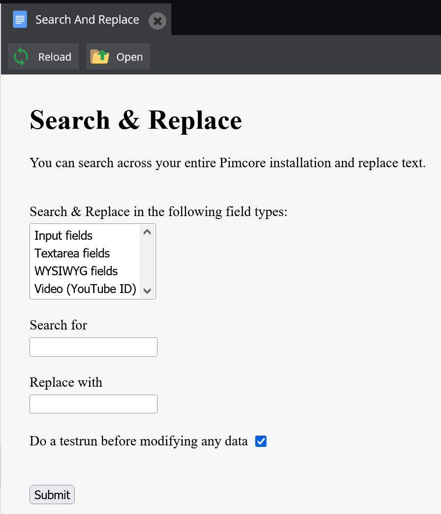

# Search & Replace Bundle for Pimcore
Add the option to search and replace text in all pimcore documents.

## Features
* Easy installation in pimcore projects (drop-in-solution)
* Multilingual admin interface to search and replace
* Testrun with replacement preview




## Installation

### Composer Installation
1. Add code below to your `composer.json` or install it via command line

```json
"require": {
    "pringuin/searchreplacebundle" : "dev-master"
}
```

### Installation via Extension Manager
After you have installed the Search & Replace Bundle via composer, open the pimcore administration backend and go to `Tools` => `Extension`:
- Click the green `+` Button in `Enable / Disable` row
- Click the green `+` Button in `Install/Uninstall` row

### Installation via CommandLine
After you have installed the Search & Replace Bundle via composer:
- Execute: `$ bin/console pimcore:bundle:enable pringuinSearchreplaceBundle`
- Execute: `$ bin/console pimcore:bundle:install pringuinSearchreplaceBundle`
